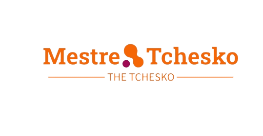

<!-- Exemplo de README.md com elementos HTML e emojis -->

<div align="center">
  
</div>

# Mestre-Tchesko - Repositório da Dissertação

<p align="center">🎓📚 Repositório da dissertação de Franchesco, realizada no período de 2021 a 2023. 📚🎓</p>

## Índice
- [Introdução](#introdução)
- [Objetivos](#objetivos)
- [Conteúdo do Repositório](#conteúdo-do-repositório)
- [Como Reproduzir o Projeto](#como-reproduzir-o-projeto)
- [Contato](#contato)

## Introdução
Neste projeto de mestrado, trabalhei com dados da SANEPAR, empresa de saneamento no estado do Paraná, Brasil, e utilizei modelos de séries temporais para análise e previsões.

## Objetivos
O objetivo principal da dissertação foi explorar e analisar os dados fornecidos pela SANEPAR com o propósito de:
- 📊 Identificar padrões em séries temporais de dados relacionados ao saneamento;
- 📈 Desenvolver modelos de previsão para auxiliar no planejamento e tomada de decisões;
- 🧠 Contribuir para a compreensão do comportamento das variáveis relacionadas ao saneamento em diferentes cenários.

## Conteúdo do Repositório
O repositório está organizado da seguinte forma:
- **/dados**: Este diretório contém os conjuntos de dados utilizados no projeto.
- **/notebooks**: Nesta pasta, você encontrará os notebooks Jupyter utilizados para a análise e os experimentos com os modelos.
- **/resultados**: Aqui estão os resultados gerados pelos modelos, bem como gráficos e métricas de desempenho.
- **/referencias**: Este diretório inclui os artigos e materiais utilizados como referência durante a pesquisa.

## Como Reproduzir o Projeto
Para reproduzir os resultados e experimentos realizados nesta dissertação, siga as instruções abaixo:

1. Clone este repositório em sua máquina local:

```bash
git clone https://github.com/Tchesko93/Mestre-Tchesko.git
```

2. Navegue até o diretório do projeto:

```bash
cd Mestre-Tchesko
```

3. Instale as dependências necessárias (caso existam) e configure o ambiente de desenvolvimento.

4. Explore os notebooks disponíveis na pasta **/notebooks** para acompanhar os passos da análise e experimentos.

## Contato
Caso você tenha alguma dúvida, sugestão ou deseje colaborar com o projeto, sinta-se à vontade para entrar em contato comigo:

- 👤 Nome: Franchesco
- 📧 E-mail: franchesco.sanches@gmail.com
```